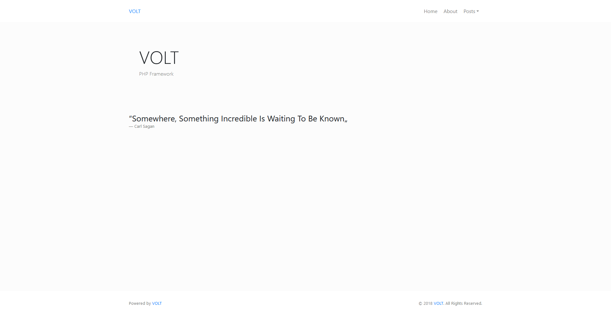

# VOLT

VOLT is a small MVC Framework powered by PHP. It's goal is not to be a professional MVC framework that can handle lots of data and users,
it is meant for people starting with PHP who want some or all features listed below. It is fully operational out of the box,
but still leaves enough space to expand on it's core functionality.

## Features

- Simple and light framework
- Makes URL's clean again, no more `example.com?id=42&page=answer`
- Comes with [Bootstrap](https://getbootstrap.com/docs/4.1/layout/overview/) out of the box
- Comes with [Font Awesome](https://fontawesome.com/) (free) out of the box
- Uses PDO for database connectivity
- Native PHP code, framework can be understood in minutes

## Installation

1. Download or Clone the VOLT repository from [here](https://github.com/Teeffelen/volt/archive/master.zip).
2. Place the `app/` and `public/` folders in your webroot, it's important to also include the `.htaccess`!
3. Open the [.htaccess](https://github.com/Teeffelen/volt/blob/master/.htaccess) in your webroot and change the `RewriteBase /` if necessary.
4. Open the [.htaccess](https://github.com/Teeffelen/volt/blob/master/.htaccess) under `public/` and change the `RewriteBase /` if necessary (the same as step 3).
5. Find the [config.php](https://github.com/Teeffelen/volt/blob/master/app/config/config.php) under `app/config/` and configure it as desired.
6. Check if the VOLT framework is online by going to your webroot domain (http://localhost or https://example.com).

## Configuration

- To add or remove routes, open the [routes.php](https://github.com/Teeffelen/volt/blob/master/app/config/routes.php) under `app/config/`, please note that these routes use the [PHP preg_match()](https://secure.php.net/manual/en/function.preg-match.php) format!
- To add or remove stylesheets, open the [header.php](https://github.com/Teeffelen/volt/blob/master/app/views/includes/header.php) under `app/views/includes/`.
- To add or remove JavaScript and/or jQuery, open the [footer.php](https://github.com/Teeffelen/volt/blob/master/app/views/includes/footer.php) under `app/views/includes/`.
- To add, edit or remove a view, open the [view](https://github.com/Teeffelen/volt/tree/master/app/views) under `app/views/pages/`, views are generated from their controller in `app/controllers/`.

## Requirements

- PHP 5.6+ (Tested on PHP 7.0)
- Apache 2.4+
- mod_rewrite activated in Apache
- MySQL (can run fine without any database also)

## Security

VOLT makes use of `mod_rewrite` and blocks all access to everything outside the `public/` folder. Your .git folder/files, operating system temp files, the application-folder and everything else is not accessible. For database requests PDO is used, so no need to think about SQL injection (unless you are using extremely outdated MySQL versions).

## Issues

Found a bug that is not supposed to be a feature? let me know by opening a [issue](https://github.com/Teeffelen/volt/issues) and I will try to fix it as soon as possible!
